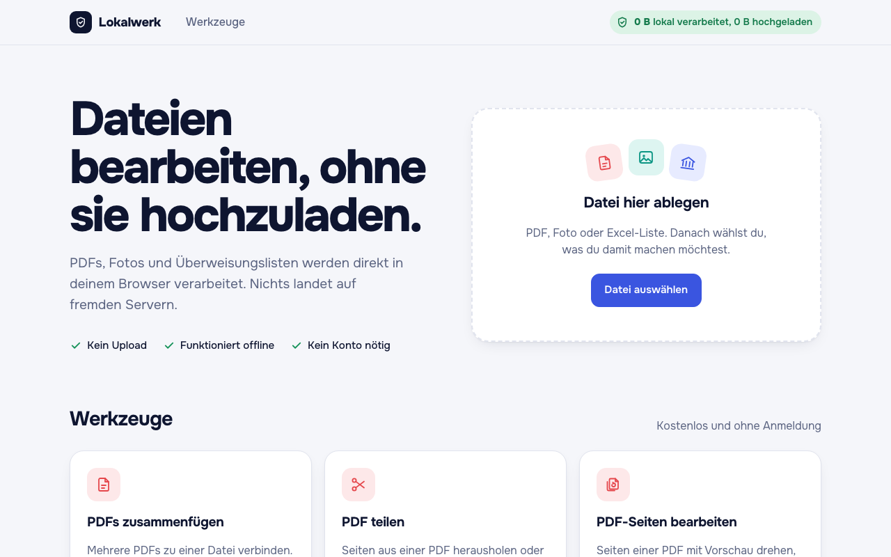
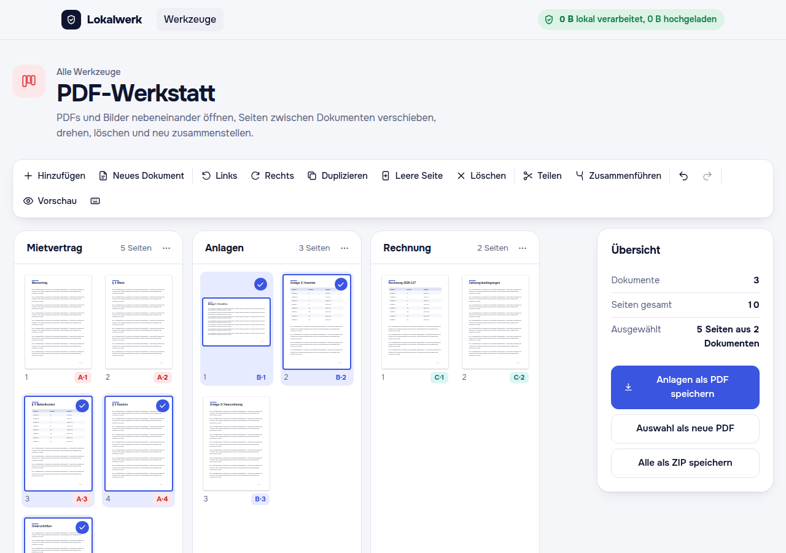
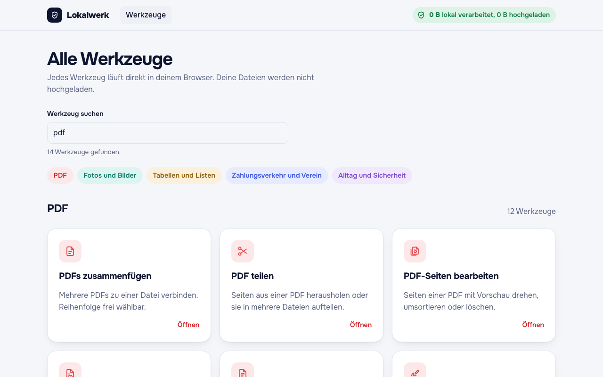
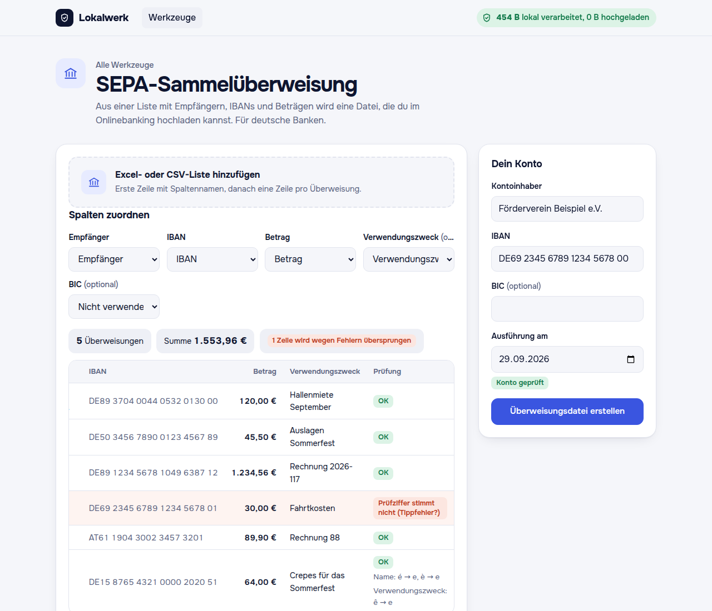
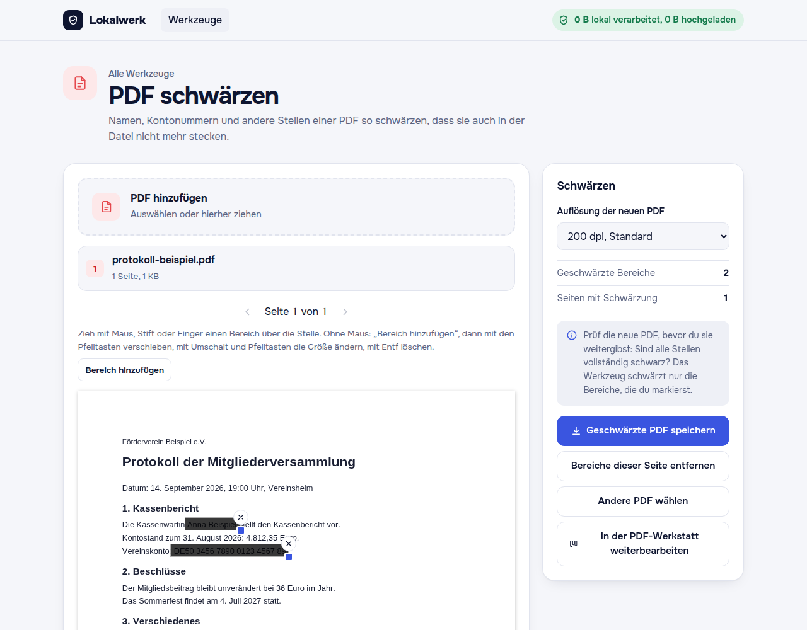
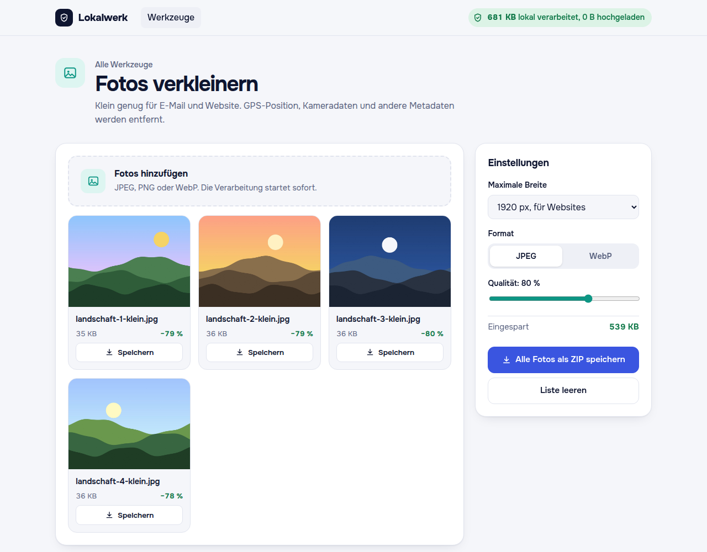
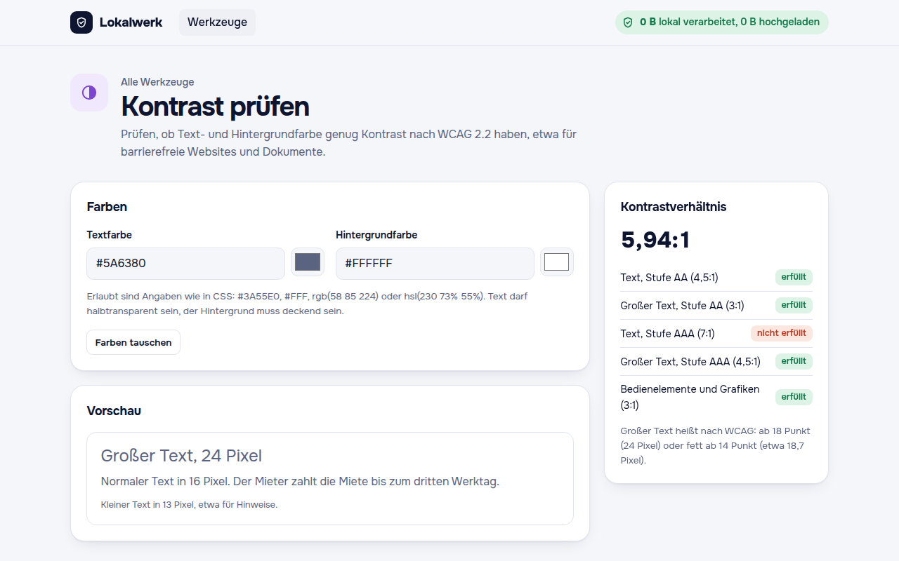
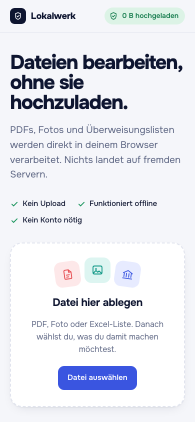
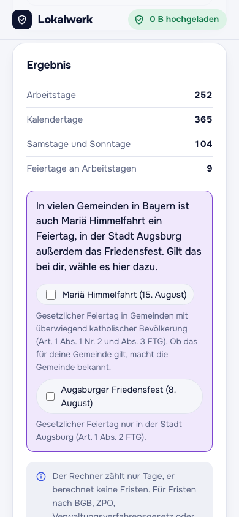

# Lokalwerk

<picture>
  <source media="(prefers-color-scheme: dark)" srcset="docs/screenshots/startseite-dunkel.png">
  
</picture>

Lokalwerk is a German-language website with 33 tools for everyday files: PDFs, photos, spreadsheets and address lists, SEPA payments, and a few small utilities. It is aimed at small businesses, freelancers, associations and administrations in Germany, Austria and Switzerland.

**Core principle: every tool runs entirely in the browser. No file ever leaves the device.** There is no backend, no database, no account, no tracking and no cookies. After a tool page has loaded, it works offline.

Status: not live yet. Lokalwerk Pro (a planned paid tier) is not implemented. See [Status](#status).

## How "nothing leaves the device" is enforced

The promise is backed by mechanisms that fail the build or block the browser, not by convention:

- **Content Security Policy** ([`public/_headers`](public/_headers)): `connect-src 'none'`, so the browser blocks every `fetch`, XHR, WebSocket and beacon from the page. `default-src 'none'`, scripts, styles, fonts and workers only from the site itself, no inline scripts or styles. The same headers are used by `vite preview` for local testing.
- **ESLint bans** ([`eslint.restrictions.js`](eslint.restrictions.js)): `fetch`, `XMLHttpRequest`, `WebSocket`, `EventSource`, `sendBeacon`, service workers, `localStorage`, `sessionStorage`, `indexedDB`, Cache Storage and cookies are errors in shipped code. The rules themselves are covered by tests.
- **`check-dist`** ([`scripts/check-dist.mjs`](scripts/check-dist.mjs)), run after every build: scans every built file for URLs. Third-party addresses are only allowed from per-library allowlists (XML namespaces and dead strings inside libraries, each approved and documented in `docs/`), and only in files that actually contain that library. It also rejects inline scripts, styles and event handlers, and fails if the pdf.js scripting sandbox or QuickJS end up in the build.
- **`chunk-guard`** ([`build/chunk-guard.ts`](build/chunk-guard.ts)): each page may statically load at most one tool's code; heavy libraries (pdf-lib, SheetJS) must live in Web Workers, and pdf.js may only be loaded dynamically.
- **License check** ([`build/licenses.ts`](build/licenses.ts)): the build fails if a shipped library is missing from the licenses page, or if the page lists a library that is not shipped.
- **Metadata check before saving**: images re-encoded by the photo tools are scanned for EXIF, XMP, IPTC and similar blocks before the download is offered; if anything remains, the file is not saved. pdf-lib is configured not to add its own producer, creator or date entries to PDFs.
- **Self-hosted everything**: the Onest font is served from the site; SheetJS is vendored from its official distribution ([`vendor/`](vendor/)); pdf.js runs without WebAssembly and without loading any extra data.

## Tools

**PDF workshop:** the main tool. Several PDFs and images open side by side, one column per document. Pages can be selected across documents (click, Shift and Ctrl/Cmd like a file manager), moved and copied between documents by dragging or with the keyboard, rotated, duplicated and deleted; blank pages can be inserted, documents split and merged. Every step can be undone. Documents are only lists of page references, so the loaded files are never changed; real PDFs are assembled in a Web Worker on export (one document, the selection, or all documents as ZIP). An unchanged document is saved as the original file. Page numbers can be set per document; they are drawn on export, so they follow the final page order. Every PDF tool below offers to continue in the workshop without reloading, with the file kept in memory.

**PDF (12 more):** merge PDFs · split PDF · edit PDF pages (rotate, reorder, delete) · PDF to images · redact PDF (pages are rasterised, nothing of the original remains) · insert signature (as an image; not an electronic signature) · fill PDF forms · page numbers · stamp and watermark · remove PDF metadata · images to PDF · scan a document (camera via the file picker, four-corner perspective correction)

**Photos and images (6):** resize photos · show and remove photo metadata · crop and rotate · pixelate faces and number plates (large blocks, no blur) · ID card copy (redaction and a permanent "KOPIE" overlay) · convert image format (JPEG, PNG, WebP)

**Spreadsheets and lists (4):** convert Excel and CSV · repair CSV (encoding, delimiters) · find duplicates · address labels from a list (sheets by dimensions, test print with frames and a 100 mm ruler)

**Payments and associations (4):** SEPA bulk transfer (pain.001 for German banks) · QR code for bank transfers (EPC069-12) · check an IBAN list · check a SEPA creditor identifier

**Everyday and security (6):** password generator · working-days calculator (statutory holidays of all 16 German states) · QR code generator · file checksum (SHA-256, SHA-1) · compare texts · contrast checker (WCAG 2.2)

## Screenshots

All screenshots show the German interface with example data from the project. They follow the viewer's light or dark mode on GitHub. The bank details are example numbers (see [`docs/beispiel-ibans.md`](docs/beispiel-ibans.md)); the sample PDFs and landscape photos are generated by the screenshot script itself.

<picture>
  <source media="(prefers-color-scheme: dark)" srcset="docs/screenshots/pdf-werkstatt-dunkel.png">
  
</picture>

The PDF workshop: each document is a column, and a Shift-click range runs across document boundaries, here from page 3 of the agreement to page 2 of the attachments. The coloured badges (A, B, C) show which file each page comes from, so mixed documents stay readable.

<picture>
  <source media="(prefers-color-scheme: dark)" srcset="docs/screenshots/werkzeuge-suche-dunkel.png">
  
</picture>

The tool overview filters all 33 tools locally while you type; here the search for "pdf" finds 15 tools. The PDF workshop leads the PDF category as a wide card.

<picture>
  <source media="(prefers-color-scheme: dark)" srcset="docs/screenshots/sepa-dunkel.png">
  
</picture>

SEPA bulk transfer: an Excel or CSV list becomes a pain.001 file. Invalid rows are flagged and skipped, never silently corrected, and every character replacement required by the German banks is shown. At 1280 px the table scrolls inside its frame; this view shows its right-hand columns.

<picture>
  <source media="(prefers-color-scheme: dark)" srcset="docs/screenshots/pdf-schwaerzen-dunkel.png">
  
</picture>

Redacting a PDF: areas are shown semi-transparent while editing. The saved PDF is rebuilt from rasterised pages with solid black areas, so nothing of the original text remains in the file.

<picture>
  <source media="(prefers-color-scheme: dark)" srcset="docs/screenshots/fotos-verkleinern-dunkel.png">
  
</picture>

Resizing photos: four generated landscape images (no people), each about 79 % smaller. Metadata such as GPS position is removed and every output file is checked for it.

<picture>
  <source media="(prefers-color-scheme: dark)" srcset="docs/screenshots/kontrast-pruefen-dunkel.png">
  
</picture>

Contrast checker: #5A6380 on white reaches 5.94:1, which passes WCAG 2.2 level AA but not AAA for normal text.

<p>
  
  &nbsp;
  
</p>

On a phone (390 px): the home page, and the working-days calculator for Bavaria, which offers regional holidays as explicit additions.

## Browser support

The tools that show or render PDFs (PDF workshop, edit PDF pages, PDF to images, redact PDF, insert signature, fill PDF forms) use the legacy build of pdf.js and support what pdf.js names for it: Chrome and Edge 125 or later, Firefox ESR, Safari 18 or later. Older browsers get a clear message instead of a broken preview. `npm run compat:pdfjs` checks this by removing the APIs that older browsers lack; Safari and Firefox are still to be tested on real devices. The other tools are built for Vite's default target (Chrome and Edge 111, Firefox 114, Safari 16.4).

## Architecture

- **Build:** Vite, TypeScript in strict mode, no UI framework. Static output for Cloudflare Pages; one HTML page per tool with its own title, description and explanatory text.
- **Runtime libraries:** pdf-lib, pdfjs-dist, SheetJS Community Edition, exifr (lite build), uqr. Everything else (ZIP writer, CSV parser, XML writer, SHA-1/SHA-256, IBAN checks, perspective correction, Easter date, …) is written in the project.
- **Web Workers** for anything heavy (PDF processing, spreadsheets, image processing), so the page stays responsive with large files.
- **`src/core/`** contains the domain logic as pure functions without DOM access, so it can be tested in Node.

```
src/core/      domain logic without DOM (pdf, images, sepa, csv, sheet, qr, dates, labels, …)
src/tools/     one folder per tool: markup, page script, worker
src/ui/        shared UI (drop zone, worker protocol, rectangle and corner editors, …)
src/styles/    design tokens and components (light and dark mode)
pages/         HTML entry point per page
build/         page registry, Vite plugins, license page, build checks
scripts/       check-dist and helper scripts
tests/         Vitest tests and fixtures
docs/          decisions, sources, legal wording, address lists
vendor/        SheetJS archive with checksum
```

## Quality

- **Tests:** 1,232 tests in 90 files (Vitest). Every module in `src/core/` has unit tests.
- **Against official specifications:**
  - SEPA pain.001 files are validated against the German banking industry's XSD (`pain.001.001.09_GBIC_5.xsd`) with xmllint, and the text rules of the DFÜ Agreement, Annex 3 are tested separately. The schema and example files may not be redistributed, so they are kept locally in `.local-specs/`.
  - SHA-1 and SHA-256 against the NIST CAVP test vectors ([`tests/fixtures/nist/`](tests/fixtures/nist/)).
  - EPC QR codes reproduce the examples in EPC069-12, and creditor identifiers are checked against the example in EPC262-08. The EPC allows reproduction only for non-commercial purposes, so these examples are kept locally in `.local-specs/`; the project's own examples run everywhere.
  - Easter dates against the table of the Physikalisch-Technische Bundesanstalt (1980–2031); public holidays against the wording of all 16 state holiday laws and their versions since 2018 ([`docs/feiertage-recht.md`](docs/feiertage-recht.md)).
  - Redaction: tests extract all text with pdf.js and search every object and decompressed stream of the output for the redacted content.
- **Accessibility:** target is WCAG 2.2 AA. Interactions are keyboard-operable, including alternatives to dragging (WCAG 2.5.7); focus is visible and `prefers-reduced-motion` is respected. Category colours: accent text at least 4.6:1 and accent icons at least 3.2:1 on their tinted backgrounds in light mode (values in `plan-phase2.md`, section 4). Screen reader tests on real devices are still outstanding.
- **Browser audit:** before each tool was committed, it was checked in headless Chrome, offline after loading: console, network requests and CSP reports. All 39 pages were checked in light and dark mode at 1280 px and 360 px width for third-party requests, console errors, horizontal overflow and visible keyboard focus. The audit scripts are not part of this repository.

## How it was built

This project was developed with [Claude Code](https://claude.com/claude-code) under the rules in [`AGENTS.md`](AGENTS.md) (no network requests at runtime, no CDNs, no tracking, official sources only, no invented standards, small steps with review). Plans, decisions and approvals are recorded in [`plan.md`](plan.md), [`plan-phase2.md`](plan-phase2.md) and [`plan-phase3.md`](plan-phase3.md) (PDF workshop); user-facing texts go through review and approval, with their status in [`docs/texte-zur-freigabe.md`](docs/texte-zur-freigabe.md). Legal wording is not written by the agent.

## Running locally

Requires Node 24 (see `.nvmrc`).

```sh
npm ci
npm run dev       # development server
npm run check     # ESLint, Prettier, tests, type check, build, build checks
npm run build     # production build into dist/
npm run preview   # serve dist/ with the production security headers
npm run screenshots  # rebuild and regenerate docs/screenshots/ (needs Google Chrome)
npm run compat:pdfjs # rebuild and check pdf.js in simulated older browsers (needs Google Chrome)
```

Without the licensed specification files in `.local-specs/` (see [`docs/lokale-spezifikationen.md`](docs/lokale-spezifikationen.md)), 1,219 tests run and the tests that depend on those files are skipped with a clear notice. The GitHub Actions workflow runs `npm run check` the same way.

## Status

- Not live yet. The remaining steps before launch are listed in [`docs/livegang.md`](docs/livegang.md); legal pages are drafts.
- Lokalwerk Pro is not implemented; its page is hidden and not linked.
- Waiting for source documents: camt.053 import and SEPA direct debit (pain.008), bank data for the IBAN check, and IBAN lengths outside the EEA.

## License

All rights reserved. The code is published for viewing only; see [`LICENSE`](LICENSE). Third-party libraries and fonts are under their own licenses.

## Deutsch

Lokalwerk ist eine Website mit 33 Werkzeugen für PDFs, Fotos, Tabellen, SEPA-Zahlungen und Alltägliches; das Hauptwerkzeug ist die PDF-Werkstatt, in der mehrere PDFs und Bilder nebeneinander bearbeitet und neu zusammengestellt werden. Alle Werkzeuge laufen vollständig im Browser; keine Datei verlässt das Gerät. Durchgesetzt wird das technisch: Content-Security-Policy mit `connect-src 'none'`, ESLint-Verbote für Netzwerk und Browser-Speicher, Build-Prüfungen (`check-dist`, `chunk-guard`, Lizenzprüfung) und eine Metadaten-Prüfung vor dem Speichern. Entwickelt mit Claude Code nach den Regeln in `AGENTS.md`, mit Plänen und Freigaben in `plan.md` und `plan-phase2.md`. Noch nicht live, Lokalwerk Pro ist nicht umgesetzt. Der Code ist nur zur Ansicht veröffentlicht (siehe `LICENSE`); Beiträge werden derzeit nicht angenommen.
